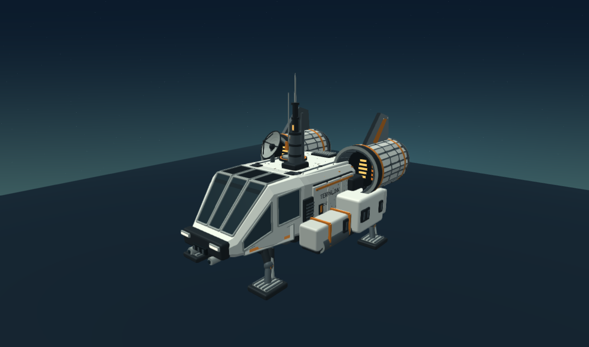

# justgame

WebGL 3D 우주 탐험 게임. 기존 5개 행성, 신비로운 생명체 11종, 채굴·건설·공유·자동 저장을 유지하고 몰입 효과와 상호작용을 확장했습니다.

그래픽은 부드러운 곡면 명암, 연속적인 지형 색상, 둥근 산과 건물 모서리, 가장자리가 옅어지는 접지 그림자를 사용합니다. FXAA로 3D 윤곽선을 다듬으며 글자와 HUD에는 필터를 적용하지 않습니다. 기기 성능에 따라 렌더링 해상도를 조절하고, 후처리를 지원하지 않는 환경에서는 기본 WebGL 화면으로 표시합니다.

자원을 채굴하면 대상에 균열이 번지고 흔들림·충격 링이 나타납니다. 마지막 타격에서는 블록 파편이 튀어 오르며 먼지와 자원 획득 효과가 이어집니다.

표면 탐험 맵은 기존보다 1.5배 넓어졌습니다. 이동 경계는 1320에서 1980으로 확장되고, 자원·생명체·유적·지형 장식도 함께 넓은 영역에 배치됩니다. 기존 저장 기록도 같은 행성에서 확장된 맵을 이어서 사용할 수 있습니다.

우주선은 첨부 참고 이미지의 형태를 직접 모델링한 **Terralink Pioneer EX-7**입니다. 경사진 다면 유리 조종석, 쌍발 엔진의 열린 흡입구와 발광부, 화물함, 안테나·접시, 착륙다리를 입체 메시로 구성했습니다. 사진의 질감을 자동 복원한 모델은 아니며 보이지 않는 면은 대칭 구조로 구성했습니다. 비행하면 착륙다리가 접히고 실제 엔진 위치에서 추진 효과가 나옵니다.

플레이어는 제공된 **K-17 탐험가 우주복** 이미지를 16개 관절로 움직이는 2.5D 캐릭터입니다. 얼굴·우주복·장비의 원본 모습을 살린 카메라 방향 빌보드이며 뒷면까지 복원한 360도 3D 모델은 아닙니다. 팔과 몸통의 메시를 분리해 팔을 들 때 이미지가 늘어나는 현상을 방지하고, 손목을 몸 앞으로 가져올 때 깊이를 조절합니다. 채굴·손목 스캔·건설·업그레이드·인사·쓰다듬기·먹이 주기·유적 조사·휴식 동작을 구분하고 채굴 빔과 도구는 움직이는 손에 연결합니다. 1인칭에는 같은 흰색·주황색 우주복의 팔과 손목 장치를 표시합니다. 이미지가 로드되기 전에는 기존 우주복이 대신 표시됩니다.

`assets/pioneer-ex7.glb`는 같은 형상의 독립적인 glTF 2.0 바이너리 모델입니다. `/models/pioneer-ex7.glb`에서도 내려받을 수 있습니다. 미터 단위, +Z 전방, 재질 3종과 이름 있는 부품 7개를 포함합니다. GLB는 착륙 상태이며 게임의 다리 전환은 렌더러가 처리합니다.

`assets/player-k17.webp`는 참고 이미지의 투명도를 보존한 고품질 게임 텍스처입니다. Worker는 `/assets/player-k17.webp`에서 제공하고, 정적 실행용 `index.html`에는 같은 이미지를 내장합니다. `game/player-rig.js`에 관절·메시·동작이 있으며, 성공한 게임 행동만 모션을 시작합니다. 비용과 보상, 기존 저장 형식은 유지됩니다.

이동 → 채굴 → 스캔 → 집 건설 → 생명체 인사의 단계형 튜토리얼을 제공합니다. 실제 행동으로 진행되고, 건너뛰기와 도움말의 다시 시작을 지원합니다. 튜토리얼 진행은 `orbit-frontier-tutorial-v1`로 저장됩니다. 대화창은 인사나 조사 동작이 끝난 뒤 열립니다.



## 실행

Node.js 22 이상에서 별도 패키지 설치 없이 실행합니다.

```sh
npm run dev
```

`http://localhost:8000/play`에서 플레이합니다. Codespaces에서는 포트 8000을 열면 됩니다. `index.html`을 브라우저로 직접 열어도 게임을 실행할 수 있습니다.

## 조작

- WASD / 방향키: 이동. Shift: 달리기·우주선 가속
- 화면 드래그: 시점 회전. 휠: 거리 조절. V: 1인칭/3인칭
- E: 채굴·교류·건물 사용·유적 조사. 대상을 클릭하면 접근 후 상호작용
- Q: 스캔. B: 건설. F: 이륙·착륙. M: 성계 지도
- Space: 점프 / 우주선 상승. C: 우주선 하강. X: 몰입 설정
- 터치 이동 패드, 채굴·스캔·건설·비행 버튼 지원

생명체를 쓰다듬거나 바이오매스 2개로 먹이를 나누면 친밀도가 올라갑니다. 친밀도 2부터 동행과 유적 길 안내를 사용할 수 있습니다. 행성마다 유적 3개가 있고 보상은 한 번씩 지급됩니다. 건물 가까이에서 E를 눌러 휴식·조명·충전·스캔·설비 업그레이드를 사용하세요.

‘4D 느낌’은 입체 화면, 방향성 효과음, 가속 시야, 화면 흔들림, 날씨와 지원 기기의 선택적 진동을 뜻합니다. 실제 4DX 좌석이나 바람·물 장비를 제어하지 않습니다. 몰입 강도를 낮추거나 끌 수 있으며 시스템의 움직임 줄이기 설정을 기본값에 반영합니다.

## 수정 및 검증

```sh
npm run build
npm test
```

- `game/`: 읽기 쉬운 게임 소스. core는 게임 규칙, renderer-3d는 WebGL, portraits는 도감 그림, app은 조작과 UI입니다.
- `scripts/build.mjs`: `game/play.txt`와 정적 실행용 `index.html` 생성
- `scripts/export-spaceship.mjs`: 게임과 동일한 우주선 메시에서 GLB 및 Worker 다운로드 데이터를 생성
- `patch/model-pack-v2.txt`: 우주선 모델 정의. `game/renderer-3d.js`의 같은 함수와 일치하는지 빌드 시 검사
- `worker.js`: `/play`에 게임을 제공하며 기존 안내 페이지·공유·시작 화면을 결합
- `patch/`: 기존 생명체 정의·시작 화면·공유 및 사이트 연결 자료
- 원래 압축 데이터는 `data/`에 남겨 두었습니다. 현재 실행에서는 사용하지 않습니다.

Cloudflare는 기존 `wrangler.jsonc`의 Worker 이름과 배포 연결을 그대로 사용합니다. `game/play.txt`는 저장소에 포함되므로 Wrangler에서 바로 배포할 수 있습니다. 게임 코드를 수정한 뒤에는 빌드 결과도 함께 커밋하세요. 로컬 개발 서버는 실제 Worker 라우팅을 Node에서 실행하며 Cloudflare 런타임 전체를 모사하지는 않습니다.

저장 키는 기존 `orbit-frontier-save-v1`을 유지합니다. 이전 행성·채굴·건물·도감 기록을 읽고 새 친밀도·유적 정보를 추가합니다. 다른 기기로 옮길 때에는 저장 관리에서 JSON을 내보내고 가져오세요.
